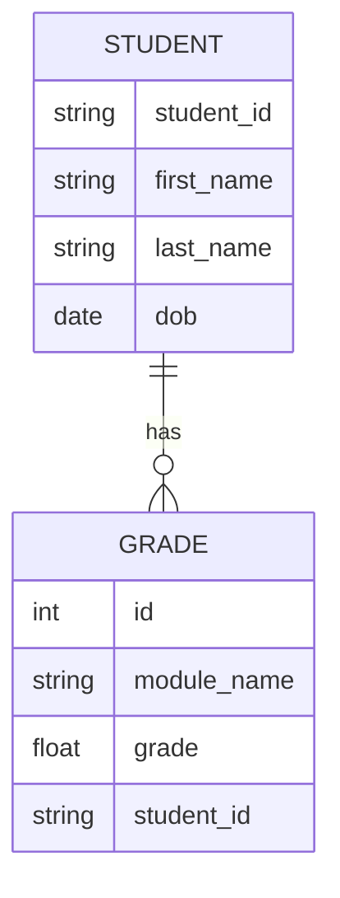

# Student Performance Dashboard
A full-stack web application for managing and analyzing student performance, built with **Django**, **React JS**, and **PostgreSQL**.

## Technical Stack

| Layer        | Technology        | Why? |
|--------------|-------------------|------|
| Backend      | Django + Django REST Framework | Clean, secure, rapid API development with built-in admin tools |
| Frontend     | React + TailwindCSS | Fast UI rendering, component reusability, and responsive design |
| Database     | PostgreSQL         | Scalable, robust relational database with strong support for analytics |

## Database Structure (ERD)


## Setup Guide

#### 1. Clone the Repository
```bash
git clone https://github.com/maryam-zafarr/grading-system.git
cd grading-system
```

#### 2. Backend Setup
```bash
python -m venv venv
source venv/bin/activate
pip install -r requirements.txt
cd backend
python manage.py migrate
python manage.py runserver 8001
```

#### 3. Populate Database (Optional)
Open a new terminal (make sure venv is activated)
```bash
cd backend
python manage.py generate_students
```

#### 4. Frontend Setup
Before setting up the frontend, make sure you have:
- Node.js (v16 or later) installed
- npm (comes with Node) or Yarn
- Backend running and accessible at http://127.0.0.1:8001

Next, open a new terminal.
```bash
cd frontend
npm install
npm run dev
```


